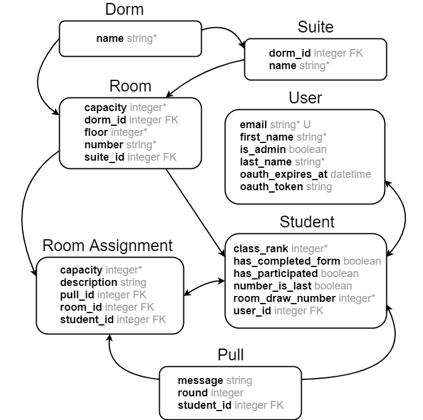

# README

## Project Name and Description
Harvey Mudd Room Draw

Every year, Harvey Mudd College students select rooms for the following year through a process called room draw.  The first stage is "digital draw," during which students indicate online which rooms they intend to select during the actual draw. Last year, digital draw was done using a Google Sheet. Our app improves digital draw by allowing students to quickly see on a dorm map which rooms are available and to choose where they intend to live.

## Architecture

* **Rooms** are grouped by **Suites** and **Dorms**. The latter two models have little content currently,
  but may be used to add dorm-specific regulations and suite-specific restrictions in the future.
* Accounts are split into **User** (holding credentials) and **Student** (holding data pertaining to room
  draw participation). This allows for the existence of admins who are not students, e.g. the dean of housing.
* **Pulls** group one or more **RoomAssignments** together as an atomic operation. **RoomAssignments**
  map a student to a room, and may result from pulls, frosh placement, or preplacement.
  

## Prerequisites

1. Install git.
2. Install Ruby version 2.4.2 and Rails version 5.1.4.

## Gems

The following are some of the "non-standard" gems we used to support our app.
* [`delayed_job`](https://github.com/collectiveidea/delayed_job): It runs queued tasks in the backend. It is used for scheduling admin emails. 
* [`rails_bootstrap_sortable`](https://github.com/DuroSoft/rails_bootstrap_sortable): The bootstrap_sortable plugin, packaged for ruby on rails.
* `daemons` is used to handle backend scripts.
* `google_drive` is used to support CIS form integration as a Google Form.
* `omniauth-google-oauth2` is used to support HMC Google login through Google Oauth.
* [`pundit`](https://github.com/elabs/pundit) is used for user authorization policy. This ensures that only admins can see admin pages and perform certain actions such as uploading a roster or editing another person's pull.
* `sqlite3` is used as the database for Active Record.
* `sass-rails` version 5.0 was used to allow SCSS for stylesheets.
* `uglifier` is used to compress JavaScript assets.
* `bootstrap-sass` version 3.3.6 was used to support bootstrap.

See the Gemfile for a full list of the Gems we used.

## Installation

1. Clone this repository: `git clone https://github.com/hmc-room-draw/room-draw.git`
2. Run `bundle install`.
3. Run `rails db:reset db:seed` to setup the database.
4. If you want to send scheduled emails, run `bin/delayed_job start`.
5. Run `rails s` to start the server.
6. Navigate to `localhost:3000.`

### Google OAuth login

This app uses Google OAuth for login. You need secret keys in JSON format for
the Google Apps API as well as our Google Service Account, both of which I have
posted on Slack. The app expects them to appear as `secrets/client.json` and
`secrets/service_account.json` respectively. These can also be obtained via the
Google Developer Console, although the service account key must be regenerated;
the extant one cannot be redownloaded.

`.env` is now free of private data, but I have left it in the `.gitignore`
in case anyone still has keys in it.

### A note on logging in

Users will only be allowed to login if a user with a corresponding email already
exists. Right now **you will need to manually create a user with your own email**
via `rails console`; enter `User.create :first_name => "First", :last_name => "Last",
:email => "your_email@g.hmc.edu", :is_admin => true`.
This will let you access `/users/new` and create other users.

### Form integration

This app now supports redirection to Google Forms, and can check the associated
spreadsheet to see if a user has replied. Some coordination is necessary
between Google Docs and this app, which requires the following setup.

### Acquiring credentials

Download `secrets.zip` from Slack for now.

These secrets can also be obtained and/or regenerated at [Google Developer Console](https://console.developers.google.com/apis/credentials).

### Configuration

1. In your Google form settings, make sure that `Collect email addresses` is
   enabled under `Settings -> General`.
2. Optionally (and highly recommended), under `Settings -> Presentation`, set
   the `Confirmation message` to include a link to the HMC room draw site.
   Google Forms cannot automatically redirect back to our site.
3. Under the `Responses` tab, click the Google Sheets button (green square with
   white cross) to create an associated Google Sheets spreadsheet.
4. Share the spreadsheet with whatever `client_email` is specified by the
   service account key information.
5. In `.env`, set `FORM_URL` to the URL of the form and `RESPONSES_URL` to the
  URL of the sheet.

### Sending scheduled emails

Run `bin/delayed_job start` if you want the ability to send scheduled emails.  Run `bin/delayed_job stop` afterwards to stop it.  If emails are not sending, you can enter `Delayed::Job.all` into the rails console to see emails in the queue.

## Functionality

### Student functionality
1. Log in with HMC gmail
2. Fill out the Google CIS form to continue
3. Upon submitting out the form, return to the main page of the digital draw where you will be directed to the dorm map page displaying dorms on Harvey Mudd’s campus
4. You can choose a dorm to view by either clicking on the dorm in the map or clicking on “View Empty Rooms By Dorm” and selecting the dorm of your choice from that table.
5. Within a dorm view, you can see each room color coded to its state relative to your pull number. Dorms are color coded to show if it’s vacant/bumpable, unpullable/unbumpable, and pulled by you 
6. You can click on vacant/pullable rooms to begin a pull request form to pull the selected room
7. When filling out the form, enter how many students you want to pull into the room with you.
8. In the pull form, fill out your information as well as the information of the student(s) you are pulling in. 
9. After submitting the form, the student can view that pull in their own pulls page.  This is navigable through the navigation bar on the top of the page.
10. To delete a pull that you are in, go to the pull page in the navigation bar. You will see a table with your name, the room you are pulled into, and a delete button. Press the delete button and a pop up will ask you to confirm the deletion. 
11. If you are bumped from a room by someone with a better draw number or class rank, you are emailed by the application that you have been bumped from said room

### Admin functionality
1. Log in as an admin (see the section "A Note on logging in").
2. You will be directed to admin home page.
3. On the homepage, you can create a room draw period.  A room draw period must exist at the current moment for students to pull rooms.
4. Upload a roster of students in [this format.](https://github.com/hmc-room-draw/room-draw/files/1541002/sampleroomdrawdata.csv.zip)
5. Navigate the site using the menu bar at the top of the page.
6. Create or edit individual students from the Student pages.
7. To create Pulls for students, either click on the Pulls page in the navigation bar or on the Map page in the navigation bar.  To create a Pull from the map, click a room and click "Create Pull."
8. To mark a room un-pullable, click on it on the Map and click "Mark Room Unpullable."
9. To send a reminder email for students, click the "Send Emails" button in the navigation bar and fill out the email form.  If you select the current date, the email will be sent immediately.  If you select a future date, the email will be sent at the current time on that date.
10. Edit an email before it has been sent by clicking on it in the "Emails" page.
Download CSV files of students' final placements and a list of who did not participate by clicking the download buttons on the admin home page.

## Known Problems

* Gives authentication errors occur at unpredictable intervals.  Try the action again.
* Creating/editing Pulls from the Map does not redirect back to the map.
* Deleting a User or Student does not delete all the information associated with them, potentially causing the app to crash.
* The form admins use to pull a room looks different than the form a student uses.
* Dorm pages sometimes need to be refreshed so they load correctly.

## Contributing

1. Fork it!
2. Create your feature branch: `git checkout -b my-new-feature`
3. Commit your changes: `git commit -am 'Add some feature'`
4. Push to the branch: `git push origin my-new-feature`
5. Submit a pull request :D
